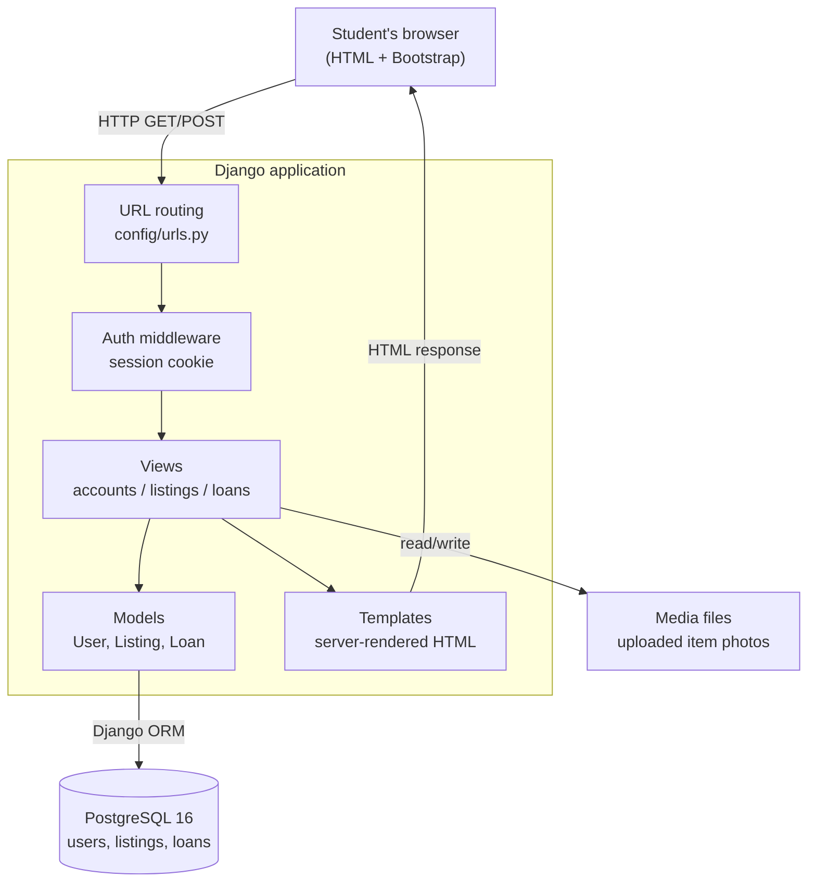
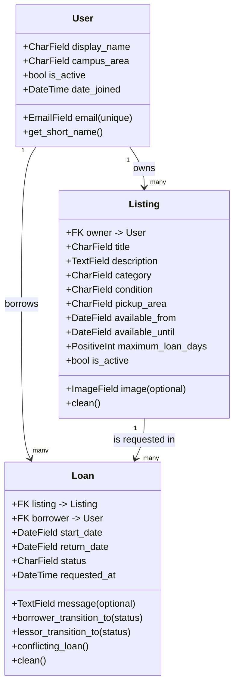
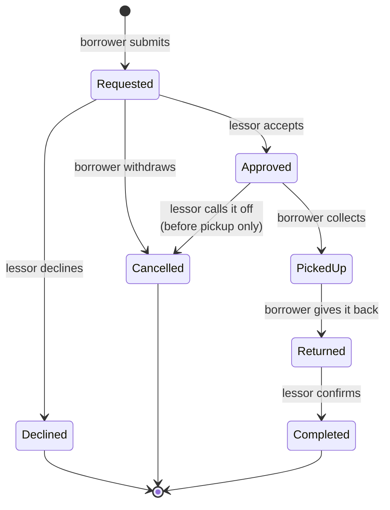
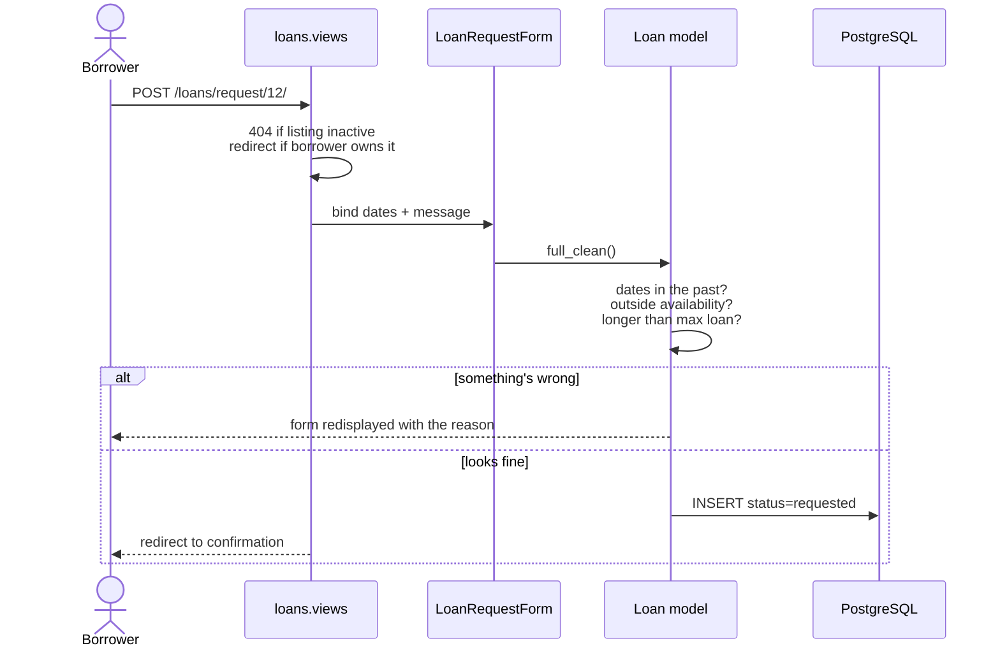
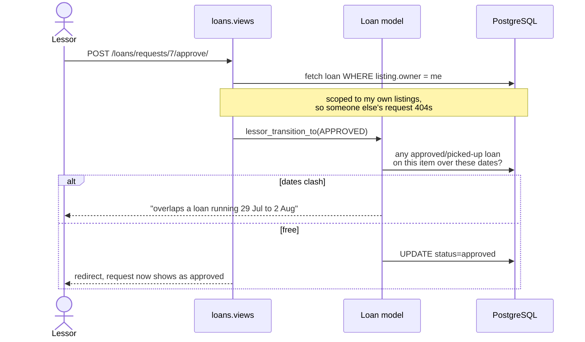
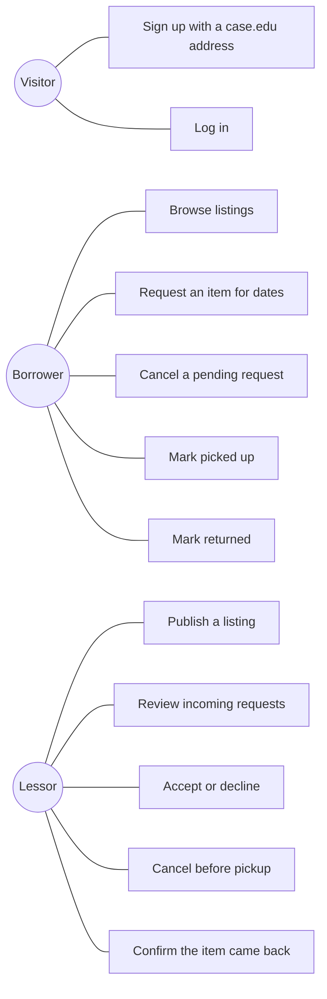
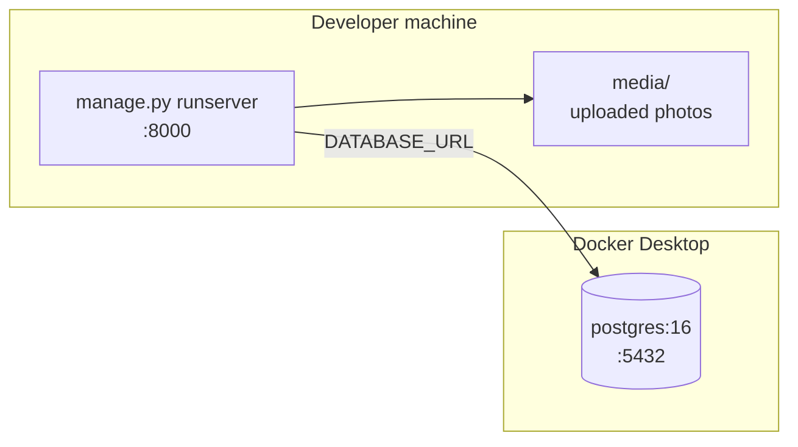

# Architecture and Design

How SpartieSwap is put together and why. Written against the code as it stands on
`main`, so if something here doesn't match the code, the code is right and this needs
updating.

## The short version

It's a Django app. One process, one Postgres database, server-rendered HTML. There's no
separate frontend, no API layer, no message queue, no external services. For an app
where a few hundred students on one campus list items and ask to borrow them, anything
more would be us building infrastructure instead of features.

Everything a user does is a normal form POST that hits a view, changes a row, and
redirects. That's the whole system.

## High-level picture

## Components and what they're responsible for

| Part | What it owns |
| --- | --- |
| `config` | Settings, the root URL map, the landing page. Reads everything environment-specific from env vars. |
| `accounts` | The custom `User` model, the `@case.edu` rule, signup, login, logout. |
| `listings` | The `Listing` model, publishing an item, browsing, the item detail page. |
| `loans` | The `Loan` model and the whole exchange lifecycle: requesting, approving, declining, pickup, return, completion. Owns the overlap check. |
| `templates` | The base layout and every page. No per-app template dirs; they all live together. |
| `static` | Our CSS. Bootstrap comes from a CDN rather than being vendored. |

`reviews` is in the plan but doesn't exist yet — ratings are Sprint 2 (stories 2.3 and
2.4). Until then the request inbox shows a borrower's completed-loan count as a
stand-in for reliability.

### Why the apps are split this way

Each one owns a table and the rules that go with it. `loans` is the only one with real
business logic in it; `listings` and `accounts` are mostly forms over data. The
dependency direction is one-way — `loans` imports from `listings`, `listings` imports
from `accounts`, and nothing imports backwards. That's deliberate: it means you can read
`accounts` without knowing anything about loans.

## Data model

Three tables. A user owns listings and borrows loans; a loan points at one listing and
one borrower. The lessor isn't stored on the loan — it's whoever owns the listing, so
there's no way for the two to disagree.

`campus_area` and `pickup_area` both come from one list in `accounts/constants.py`. We
deliberately don't store exact addresses or use location services; pickups get arranged
at the level of "North Residential Village".

## The loan lifecycle

This is the part worth understanding, because it's where all the rules live.

Who's allowed to make which move is not decided in the template or the view — it's two
dicts on the model, `BORROWER_TRANSITIONS` and `LESSOR_TRANSITIONS`. A view asks for a
transition and the model either does it or raises.

That matters because the buttons on a page aren't security. Someone can POST straight at
`/loans/requests/5/approve/` without ever loading the page. Because the check is on the
model, a borrower still can't approve their own request, and a lessor still can't mark an
item picked up on someone else's behalf.

### Requesting an item

### Approving one, and the overlap check

Two loans clash when each starts on or before the other ends. Dates count as inclusive
at both ends — if someone has an item until the 24th they've still got it on the 24th,
so the next loan can only start on the 25th. That's what makes genuine back-to-back
bookings work without accidentally double-booking a handover day.

Only approved and picked-up loans block. Declined and cancelled ones don't, and
cancelling an approved loan frees its dates again.

## Who can do what

Borrower and lessor aren't account types — they're just what you're doing at the time.
The same student lists a drill and borrows a calculator. Which actions you get on a
given loan depends on whether you're the borrower or the one who owns the listing.

## Security

**Getting in.** Django's session auth, cookie-based. Passwords hashed with PBKDF2, which
is Django's default; we never wrote any of that ourselves. Signup rejects anything that
isn't `@case.edu`, comparing the whole domain rather than using `endswith` so
`someone@notcase.edu` doesn't slip through. Emails are lowercased before saving so you
can't register the same address twice with different capitalisation.

**Staying in your lane.** Every view that touches a loan filters the query by the
current user — `borrower=request.user` for borrower actions, `listing__owner=request.user`
for lessor ones. Someone else's loan comes back as a 404 rather than a 403, which also
avoids confirming that a given ID exists.

**The usual web stuff.** CSRF tokens on every form, which Django enforces. The ORM
parameterises queries so SQL injection isn't a concern. Templates autoescape, so a
listing title containing HTML renders as text. Actions that change something are POST
only — a GET at an approve URL returns 405.

**Secrets.** Nothing sensitive is committed. `SECRET_KEY`, database credentials and the
campus domain all come from environment variables, with `.env` gitignored and
`.env.example` holding safe development defaults.

**What we're not doing.** No rate limiting on login, no email verification, no 2FA, no
password reset flow. All reasonable for a course project on a trusted campus network,
all things a real deployment would need.

## Configuration

Everything environment-specific is an env var, read through `django-environ`:

| Variable | What it does |
| --- | --- |
| `DJANGO_SECRET_KEY` | Signing key for sessions and CSRF |
| `DJANGO_DEBUG` | `True` locally, `False` anywhere real |
| `DJANGO_ALLOWED_HOSTS` | Comma-separated hostnames |
| `DATABASE_URL` | Postgres connection string |
| `CAMPUS_EMAIL_DOMAIN` | Which domain can register — `case.edu` |

That last one is why the campus restriction isn't hardcoded anywhere. Point it at a
different school and the whole rule follows.

## Running it

Development is one machine: Django's dev server on port 8000, Postgres 16 in Docker on
5432, uploaded photos written to `media/` on disk.

CI is the same shape with a real Postgres service container instead of Docker Compose,
which is how we know the app isn't quietly depending on anything local.

We haven't deployed it anywhere. If we did, the changes are the ones you'd expect and
none of them touch application code: `DEBUG=False`, a real `SECRET_KEY`, real hostnames
in `ALLOWED_HOSTS`, a WSGI server like gunicorn instead of `runserver`, static files
collected and served by something else, and media on object storage rather than local
disk since the filesystem wouldn't survive a redeploy.

## Logging and monitoring

Currently Django's defaults, which means request logs to the console and tracebacks in
the browser while `DEBUG` is on. That's fine for development and not enough for
anything else — a deployed version would want structured logs, an error tracker, and an
uptime check. Listing it honestly rather than claiming we have monitoring we don't.

## Why these technologies

**Django.** Auth, the ORM, migrations, the admin, CSRF, form validation and a test
framework all arrive in the box. On a two-week project the alternative is spending the
first week rebuilding those. The admin in particular saved us a lot — we could inspect
and fix data without writing a single screen for it.

**Server-rendered templates instead of a JavaScript frontend.** Every page here is a
form and a list. A React frontend would mean a second codebase, an API layer, and a
build step, in exchange for interactivity these pages don't need.

**PostgreSQL over SQLite.** Real date and constraint handling, and everyone develops
against the same engine we test against. It runs in Docker so nobody has to install a
database by hand.

**Bootstrap from a CDN.** No build tooling at all. We write one small CSS file for the
handful of things Bootstrap doesn't cover.

**GitHub Actions.** Already where the code lives, and the free tier covers a project
this size.

## Decisions we'd flag to anyone reading the code

**The custom user model exists from the very first commit.** Django makes swapping the
user model painful once migrations exist, and we knew we wanted email login instead of
usernames. Doing it up front cost nothing; doing it in week two would have been a mess.

**One `Loan` model with a status field, not separate Request and Loan tables.** The
lifecycle is one thing moving through states. Splitting it would mean copying rows
between tables at approval time and joining them back together for any history view.

**Transitions are data, not `if` statements.** Two dicts keyed by current status. Adding
the lessor side in story 1.4 meant adding entries, not rewriting logic, and the tests
for the borrower side kept passing untouched.

**The overlap check lives on the model, not in the view.** It's a rule about loans, so
it belongs with loans. It also means it can't be bypassed by hitting the URL directly.
