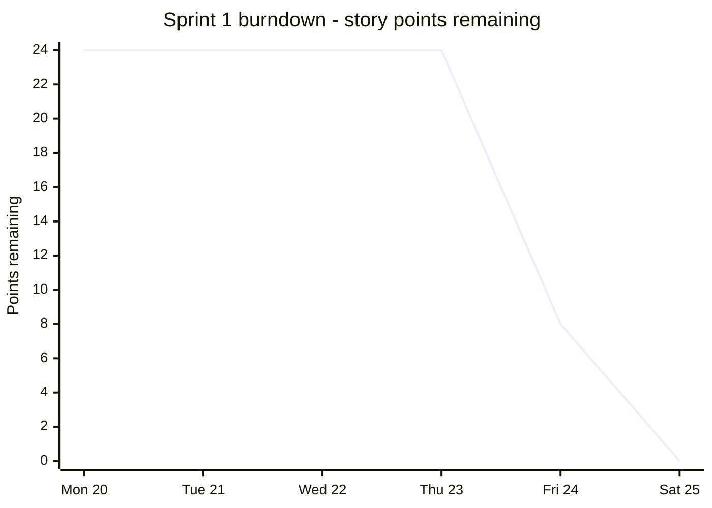

# Project Status — end of Sprint 1

Where things stand after Sprint 1 (20–24 July). Everything here is pulled off the actual
GitHub issues and pull requests rather than from memory, so it should line up with what
you see on the repo.

## Feature 1 is done

All six stories are closed and merged into `main`. Feature 1 was meant to be a complete,
usable exchange on its own — not just a directory — and it is. You can sign up, list
something, find something, ask for it, get approved, pick it up, give it back, and have
the owner confirm it came back.

| Story | Points | Issue | PR | Merged |
| --- | --- | --- | --- | --- |
| 1.1 Create an item listing | 5 | [#1](https://github.com/AlexProspal/SpartieSwap/issues/1) | [#21](https://github.com/AlexProspal/SpartieSwap/pull/21) | 24 Jul |
| 1.2 Browse active listings | 3 | [#2](https://github.com/AlexProspal/SpartieSwap/issues/2) | [#20](https://github.com/AlexProspal/SpartieSwap/pull/20) | 24 Jul |
| 1.3 View and request an item | 5 | [#3](https://github.com/AlexProspal/SpartieSwap/issues/3) | [#22](https://github.com/AlexProspal/SpartieSwap/pull/22) | 24 Jul |
| 1.4 Manage incoming requests | 5 | [#4](https://github.com/AlexProspal/SpartieSwap/issues/4) | [#27](https://github.com/AlexProspal/SpartieSwap/pull/27), [#29](https://github.com/AlexProspal/SpartieSwap/pull/29) | 25 Jul |
| 1.5 Manage my borrowing | 3 | [#5](https://github.com/AlexProspal/SpartieSwap/issues/5) | [#25](https://github.com/AlexProspal/SpartieSwap/pull/25) | 24 Jul |
| 1.6 Manage my lending | 3 | [#6](https://github.com/AlexProspal/SpartieSwap/issues/6) | [#28](https://github.com/AlexProspal/SpartieSwap/pull/28) | 25 Jul |

**24 story points delivered.**

Two other pieces of work that weren't user stories but had to happen:

| Work | Issue | PR |
| --- | --- | --- |
| Project setup — Django, Postgres, auth, CI | [#19](https://github.com/AlexProspal/SpartieSwap/issues/19) | [#18](https://github.com/AlexProspal/SpartieSwap/pull/18) |
| CI wasn't running on stacked PRs | [#24](https://github.com/AlexProspal/SpartieSwap/issues/24) | [#29](https://github.com/AlexProspal/SpartieSwap/pull/29) |

## Nothing was dropped

Every story planned for Sprint 1 shipped. Story 1.4 was the only one that landed late —
it was finished on time but got lost on a branch for a few hours (see the risks below),
so it merged early on the 25th instead of during the 24th.

Feature 2 hasn't started, which is on plan. Sprint 2 runs 27–31 July.

| Story | Points | Issue |
| --- | --- | --- |
| 2.1 Search and filter listings | 3 | [#7](https://github.com/AlexProspal/SpartieSwap/issues/7) |
| 2.2 Manage my listings | 3 | [#8](https://github.com/AlexProspal/SpartieSwap/issues/8) |
| 2.3 Borrowing history and review a lessor | 5 | [#9](https://github.com/AlexProspal/SpartieSwap/issues/9) |
| 2.4 Lending history and review a borrower | 5 | [#10](https://github.com/AlexProspal/SpartieSwap/issues/10) |

## Burndown

24 points at the start of Sprint 1, closing as each story merged.



The shape is honest but it isn't pretty. Nothing closed until Thursday, then almost
everything landed in one day.

That's partly the nature of the first sprint — nobody could finish a story until the
project scaffold, the user model and the database existed, and that only merged on the
24th. Everything else was blocked behind it. It's also partly us: the work was being
written for days before it merged, but it sat in branches instead of going in
incrementally.

The fix for Sprint 2 is to get stories into `main` as they finish rather than merging a
pile of them at once. Feature 2's four stories are much more independent than Feature
1's were — search, listing management, and the two history views barely touch each
other — so there's no structural reason for a repeat.

### Who did what

Everyone has committed code, which the course requires. It isn't even, though:

| Person | Commits on `main` | Lines added |
| --- | --- | --- |
| Josef Broz | 4 | ~1,840 |
| Alexander Prospal | 2 | ~1,290 |
| Shenguo Wu | 1 | ~350 |
| Gina Cheng | 2 | ~240 |

Worth naming rather than hiding. For Sprint 2, Gina and Shenguo should take the larger
stories — 2.3 and 2.4 are 5 points each and are the two with the most new code in them —
so the totals even out by the final report.

## Risks

**Work getting stranded on feature branches.** *(happened twice, now fixed)*

We twice opened a pull request that targeted another feature branch instead of `main`.
Both times the branch we were targeting got merged into `main` first, so our PR then
merged into a branch nobody was looking at again, and the code silently never arrived.
It cost us most of an evening on story 1.4.

Fixed by making CI run on every pull request rather than only ones targeting `main`, and
writing the rule into the README: branch off `main`, target `main`. Also worth turning on
branch protection so it's enforced rather than just written down.

**Two people building the same thing at once.** *(happened twice, mitigated)*

Stories 1.3, 1.5 and 1.6 all needed the `Loan` model, and because they were being worked
in parallel we ended up creating the `loans` app from scratch three separate times, with
incompatible status values and field names each time. Reconciling them took real work.

The nastier part: when the last two versions were combined, **git reported no conflict at
all**. Both files declared `LESSOR_TRANSITIONS` at the top level, which merges perfectly
cleanly — and Python keeps whichever comes last. Half the transitions would have silently
stopped working with every test still green. We only caught it by reading the merged
file.

The lesson is that a clean merge isn't a correct one, and that shared models need one
owner. For Sprint 2, whoever picks up 2.3 and 2.4 should agree on the `Review` model
between them before either starts writing it.

**Uneven contribution.** *(live)*

See the table above. Being tracked; the fix is story assignment in Sprint 2.

**The documented setup has never been fully verified.** *(live)*

The README tells you to run `docker compose up -d`, and Docker wouldn't pull images on
the machine most of this was written on. Everything was tested against SQLite locally
and against CI's own Postgres service instead. The compose file is unremarkable and
almost certainly fine, but nobody has actually followed the README start to finish on a
clean machine. Someone needs to, because the instructor will.

**Sprint 2 is shorter than it looks.** *(live)*

Five days for 16 points, with the final report and the presentation in the same week.
Stories 2.3 and 2.4 both need a `Review` model that doesn't exist yet.

## Technical debt and known bugs

Nothing here is broken as far as a user is concerned. It's things we know about and
chose to leave.

| Item | Impact | Priority | Plan |
| --- | --- | --- | --- |
| Overlap is only checked at approval, not when requesting | Two people can both request the same dates; the second just gets declined. Slightly annoying, not wrong. | Low | Leave it. Showing taken dates on the request form is nicer but it's a Sprint 2 nice-to-have at best. |
| "My Listings" in the nav is a dead greyed-out link | You can get to owner controls from the browse cards, but the nav promises a page that doesn't exist | Medium | Story 2.2 builds it. |
| Reliability is a completed-loan count, not a rating | Weaker trust signal than the wireframe shows | Medium | Stories 2.3 and 2.4 add real ratings. |
| Inclusive dates were our call, not the team's | Story 1.4 said "handle back-to-back correctly" without defining it. We decided a loan occupies its return date. If the team disagrees it's a one-line change. | Low | Confirm at Sprint 2 planning and leave it. |
| No `reviews` app yet | Two Sprint 2 stories depend on a model nobody has written | High | First thing in Sprint 2. Agree the model before splitting 2.3 and 2.4. |
| Two GitHub identities for one person | Alex's commits are split across two email addresses, so contributor stats undercount him | Low | Cosmetic. Fix with a `.mailmap` if it matters for the final report. |
| No rate limiting, email verification or password reset | Fine for a course project, not for anything real | Low | Out of scope. Documented in the architecture notes. |

### Not bugs, but worth knowing

- **Error messages needed a settings fix to show up at all.** Django tags error messages
  `error` and Bootstrap wants `danger`, so every error was rendering as unstyled plain
  text. Found it while testing story 1.4 — it had been broken since the scaffold, just
  invisible because nothing had produced an error message yet.
- **A multi-line `{# #}` comment renders as visible text.** Django's comment tag is
  single-line only. Caught it in the browser during 1.5, not in the tests, because tests
  don't look at the page.

## Testing

80 automated tests, all passing, run on every pull request against a real PostgreSQL 16
service.

| App | What's covered |
| --- | --- |
| `accounts` | Campus email rule including lookalike domains, case handling, duplicate accounts, login and logout |
| `listings` | Publishing, every validation rule, browse visibility, owner-only controls |
| `loans` | The full lifecycle, date validation, overlap and back-to-back, and every permission boundary |

**Coverage is 98%** — 457 statements, 10 missed. The gaps are error branches that are
awkward to reach from a test: a couple of guard clauses in the user manager, the media
URL line that only runs with `DEBUG` on, and some early returns in the loan model.

CI attaches the full line-by-line report to every run as a downloadable artifact, so you
can check that number rather than trust it. It's under Artifacts on the Actions page as
`coverage-report`.

To run it yourself:

```bash
coverage run manage.py test
coverage report
```
