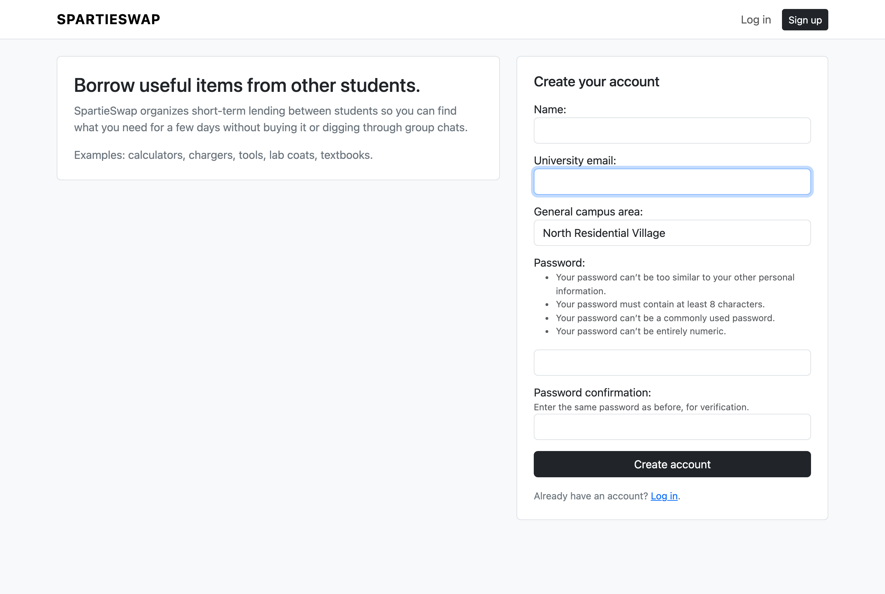
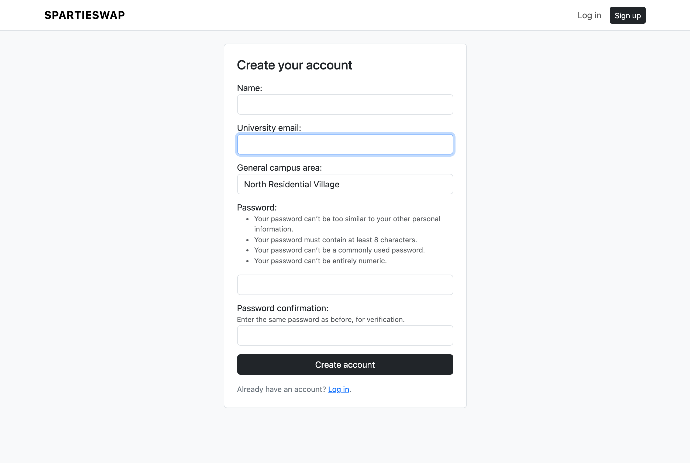
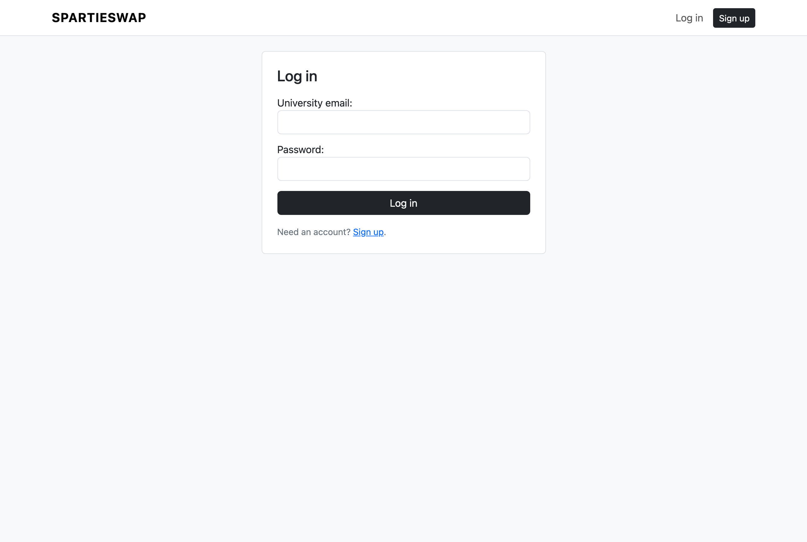
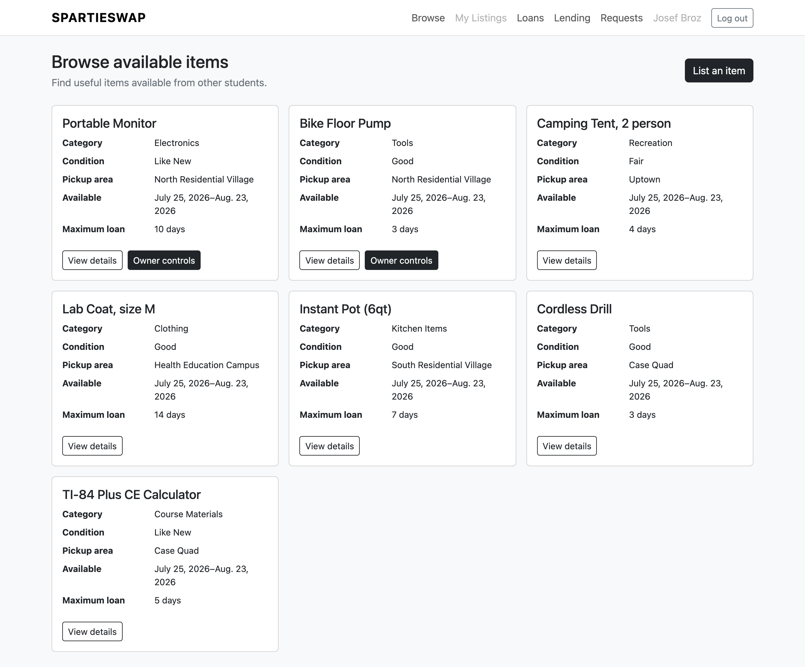
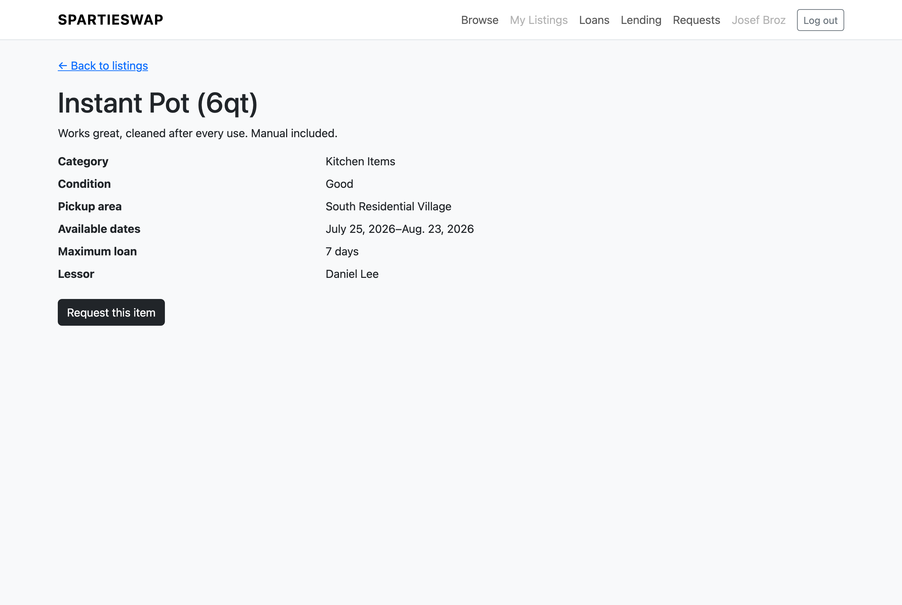
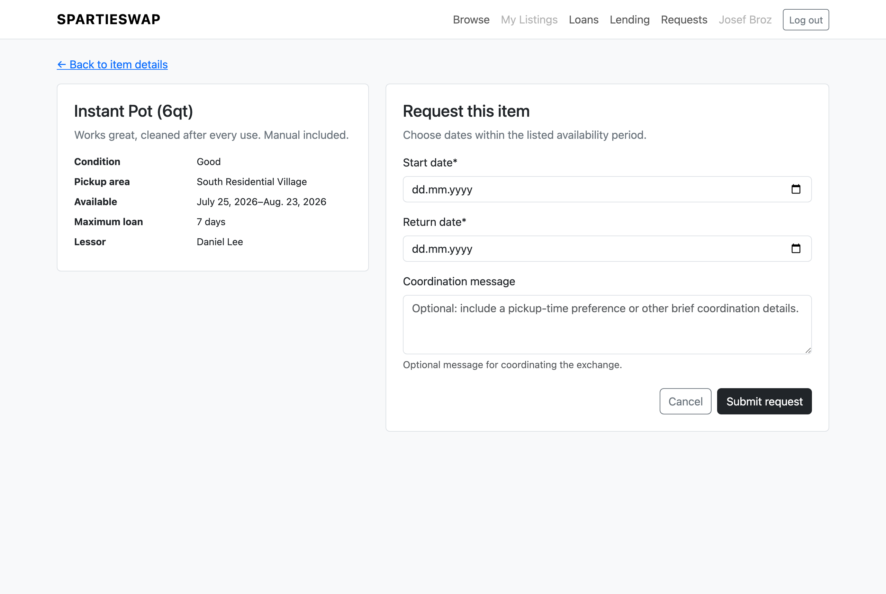
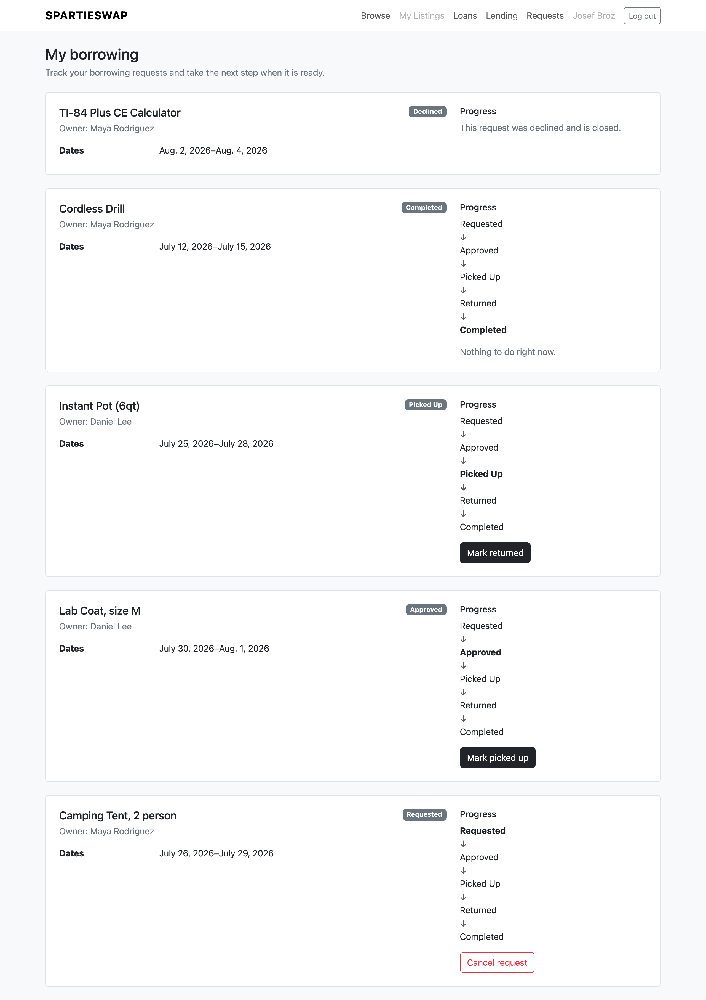
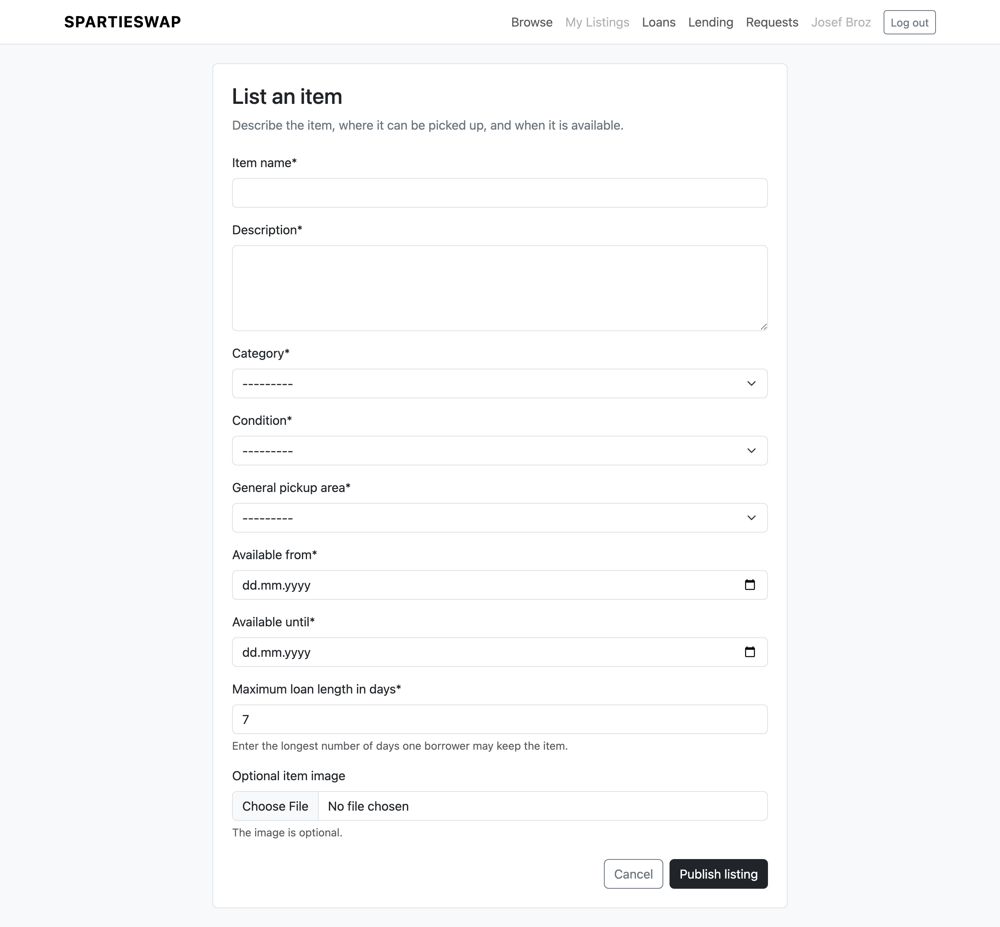
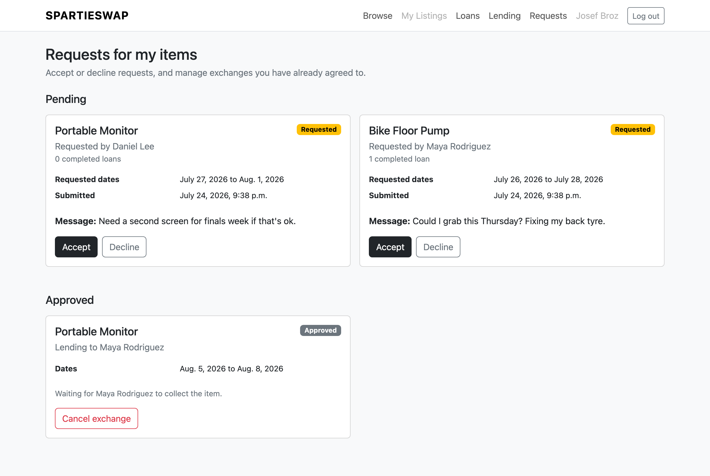
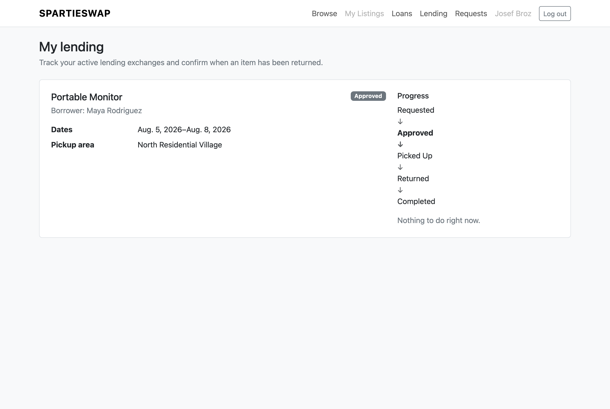

# SpartieSwap User Manual

How to use the app, with screenshots of every screen. All of these are real pages from a
running copy with sample data in it.

If you just want to get the thing running on your own machine, the setup steps are in
the [README](../README.md) instead.

## Contents

- [Getting an account](#getting-an-account)
- [Finding something to borrow](#finding-something-to-borrow)
- [Asking to borrow an item](#asking-to-borrow-an-item)
- [Keeping track of what you've borrowed](#keeping-track-of-what-youve-borrowed)
- [Listing something of your own](#listing-something-of-your-own)
- [Handling requests for your stuff](#handling-requests-for-your-stuff)
- [Lending things out](#lending-things-out)
- [Things that will stop you](#things-that-will-stop-you)

## Getting an account

The landing page explains what the app is, with the signup form next to it.

You need a `@case.edu` address. That's the whole point of the app — everyone on it goes
to the same school, so you're lending to someone you could plausibly run into. Anything
else gets turned away.

Fill in your name, your university email, roughly where on campus you are, and a
password. The campus area is a rough neighbourhood, not an address — it's there so
people can tell whether picking something up is a two-minute walk or across campus. We
don't ask for your address and we don't use your location.

Once you've signed up you're logged straight in. Coming back later, use the login page:

You log in with your email. There's no separate username to remember.

## Finding something to borrow

**Browse** in the top nav shows everything currently on offer.

Each card gives you the category, condition, where you'd pick it up, the dates it's
free, and the longest you're allowed to keep it. Your own listings show up here too,
with an extra **Owner controls** button — that's just so you can see what everyone else
sees.

Click **View details** for the full description and who owns it.

Searching and filtering are coming in Sprint 2. Right now it's one list of everything
active.

## Asking to borrow an item

Hit **Request this item** on the detail page.

Pick your start and return dates. The item's availability window and maximum loan length
are shown on the left so you don't have to guess. The message is optional and it's worth
using — "could I grab this Thursday afternoon?" saves a round trip.

Your request goes to the owner and sits as **Requested** until they respond. You'll see
it on your Loans page either way.

## Keeping track of what you've borrowed

**Loans** in the nav shows everything you've asked for, whatever state it's in.

Every card shows a progress ladder with the current step in bold, and exactly one button
— whatever it's your turn to do:

| Where it's at | What you do |
| --- | --- |
| Requested | Wait for the owner. You can **Cancel request** if you've changed your mind. |
| Approved | Go and get it, then hit **Mark picked up**. |
| Picked Up | You've got it. When you hand it back, hit **Mark returned**. |
| Returned | Nothing — the owner confirms it arrived. |
| Completed | Done. |
| Declined | The owner said no. Nothing more to do. |

Declined and cancelled requests skip the ladder and just say they're closed, since they
never actually went anywhere.

The one that catches people out is **Mark returned**. Hitting it doesn't finish the
loan — the owner still has to confirm they got the item back. That's deliberate, so one
side can't close out an exchange on their own.

## Listing something of your own

**List an item** on the browse page.

You need a name, a description, a category, the condition, a pickup area, the dates it's
available, and the longest you'll let someone keep it. A photo is optional.

Two things worth thinking about:

**Maximum loan length** is your protection against someone keeping your drill for three
weeks. It can't be longer than your availability window — the form will tell you if you
try.

**Availability dates** are when the item can be out at all. People can only request
dates inside that window.

Once you save it, it's on the browse page immediately.

## Handling requests for your stuff

**Requests** in the nav is where anything anyone's asked for shows up.

Each pending request shows who's asking, the dates they want, their message, and how
many loans they've completed. That last one is a rough reliability signal — someone with
a few completed exchanges has done this before and given things back. Star ratings are
coming in Sprint 2; for now it's just the count.

**Accept** or **Decline**. Either way the borrower sees the result on their Loans page
straight away.

Underneath, **Approved** lists exchanges you've already agreed to but haven't handed
over yet. If something changes and you can't do it after all, **Cancel exchange** pulls
out — but only before pickup. Once the item's actually gone, you can't cancel it out
from under them; it has to come back through the normal return.

## Lending things out

**Lending** shows exchanges that are underway — approved, picked up, or returned.

When someone marks an item returned, it turns up here waiting for you to confirm you
actually got it back. Confirming moves it to Completed and closes the loan out.

## Things that will stop you

Not bugs — the app pushing back on purpose.

**"Enter a valid case.edu email address."** You're signing up with a personal address.
Note that a lookalike like `you@notcase.edu` gets rejected too.

**"An account with this email already exists."** You already signed up. Capitalisation
doesn't create a second account — `Me@case.edu` and `me@case.edu` are the same person.

**"The start date cannot be in the past."** Can't book backwards.

**"The return date must be on or after the start date."** Dates are the wrong way round.

**"The start date must fall within the listing's availability."** You've picked dates
outside the window the owner set. It's on the detail page.

**"The requested loan exceeds this item's maximum loan length."** You're asking for
longer than the owner allows. Shorten it.

**"These dates overlap an approved loan running [dates]."** You're the owner trying to
approve two people for the same item at the same time. The message tells you which loan
you're clashing with, so you can either decline this one or ask them to shift.

Worth knowing how the dates work here: they're inclusive at both ends. If someone has
your drill until the 24th, they've still got it *on* the 24th, so the next person can
only start on the 25th. Genuine back-to-back bookings are fine; you just can't overlap
the handover day.

**"You cannot request your own listing."** You're looking at your own item. The request
button doesn't normally appear for owners.

**"That action is not available for this borrowing request."** You've tried a step
that's out of order — marking something picked up before it's been approved, say.
Usually means the page was open in another tab and has moved on since.

## What isn't built yet

Being straight about the gaps, as of the end of Sprint 1:

- **Search and filters** — Sprint 2. Browse shows everything.
- **My Listings** — the nav link is greyed out. You can reach owner controls from the
  browse cards in the meantime. Sprint 2.
- **Star ratings and reviews** — Sprint 2. Completed-loan counts stand in for now.
- **Borrowing and lending history** — Sprint 2. Everything's on one list regardless of
  age.
- **Overdue warnings** — Sprint 2.
